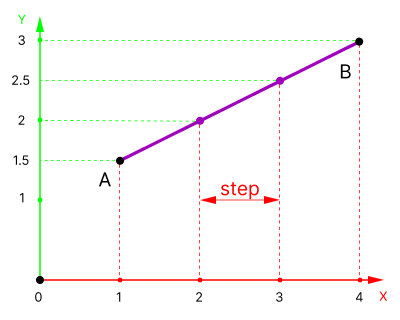
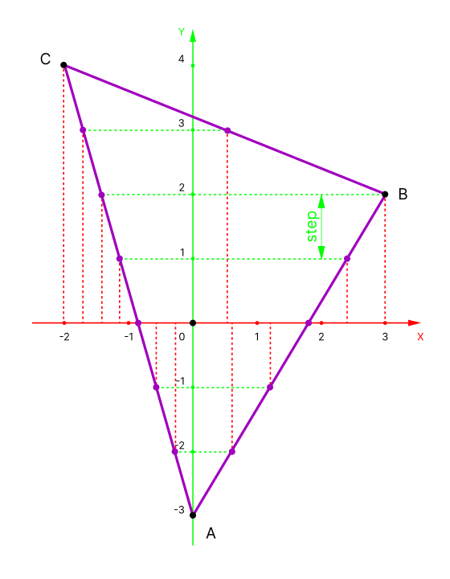

# class Interpolation
The `Interpolation` class provides methods for linear interpolation and edge interpolation. It is used for the rasterization and rendering process.
## Content
- [Methods](#Methods)
  - [`Linear`](#Linear)
  - [`Edge`](#Edge)
---
## Methods
### `Linear`
> Time complexity: O(n).
##### Declaration
```cpp
public static std::vector<float>  Interpolation::Linear(float xA, float yA, float xB, float yB, float step);
```
##### Description
Calculates intermediate values of a linearly function on the interval from `xA` to `xB` with a specified step. If `xA` is equal to `xB`, a vector containing a single value of `yA` is returned.
##### Parameters
- `xA` — coefficient x of point A. Must be less than `xB`.
- `yA` — coefficient y of point A. 
- `xB` — coefficient x of point B. 
- `yB` — coefficient y of point B. 
- `step` — default is 1.0. 
##### Returns 
- `std::vector<float>` -  a vector of interpolated values of **Y** for each step in **X**.
##### Usage 
```cpp
std::vector<float> result = Interpolation::Linear(1.0f, 1.5f, 4.0f, 3.0f);
// output: 
// result = {1.5, 2, 2.5, 3};
```
##### Mathematical description
Linear interpolation is described with next equation:
```math
y = y_A+(x-x_A)\cdot \frac{(y_B-y_A)}{(x_B-x_A)}
```
For example you have two points `A(1, 1.5)` and `B(4, 3)`. You want to know the value **`y`** for **`x = 3`**. Then:
```math
y = 1.5 + (3-1)\cdot \frac{(3 - 1.5)}{4 - 1} = 2.5
```
##### Visualisation

---
Green lines are interpolated values depending on the values of the variable **X**.
> **Note**
> The coordinates must be sorted and xB must be greater than xA.
---
### `Edge`
Interpolates values along the edges of a triangle to rasterize it. Takes coordinates of points A, B and C. Returns two arrays. The first array - interpolated values between points A and C, the second array - interpolated values between points A and B, B and C. 
> Time complexity: O(n).
##### Declaration
```cpp
public static std::vector<std::vector<float>> Interpolation::Edge(float xA, float yA, float xB, float yB, float xC, float yC, float step);
```
##### Parameters
- `xA` — coefficient x of point A. Must be less than `xB`.
- `yA` — coefficient y of point A. 
- `xB` — coefficient x of point B. 
- `yB` — coefficient y of point B. 
- `xC` -  coefficient x of point C. 
- `yC` - coefficient y of point C.
- `step` - default is 1.0.
##### Returns 
- `std::vector<std::vector<float>>` — two arrays:
  - Array of interpolated values between points A and C.
  - Array of interpolated values along AB and BC.
##### Usage
```cpp
std::vector<std::vector<float>> result = Interpolation::Edge(0.0f, -3.0f, 3.0f, 2.0f, -2.0f, 4.0f);
// output:
// result[0] = {0, -0.285, -0.571, -0.857, -1.142, -1.428, -1.714, -2}; points from A to C
// result[1] = {0, 0.6, 1.2, 1.8, 2.4, 3, 0.5, -2}; points from A to B and B to C
```
##### Visualisation

---
Red lines are interpolated values depending on the variable **Y**. The dependent variable is specially changed from **X** to **Y** for rasterization to be **line-by-line**. This is due to storage in memory of the array representing the canvas.
> **Note**
> Coordinates Y for all points must be pre-sorted in ascending order from the lowest to the highest Y coordinate.
